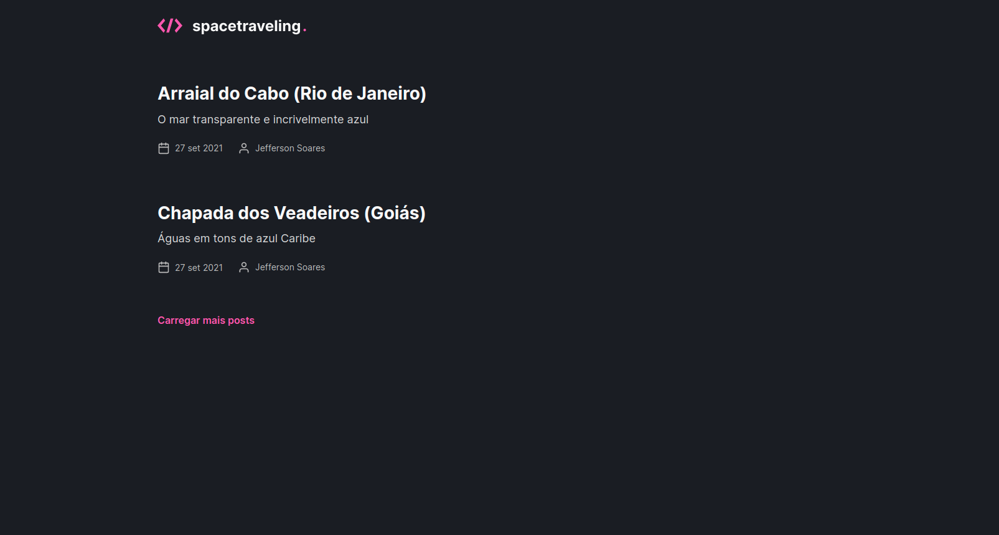
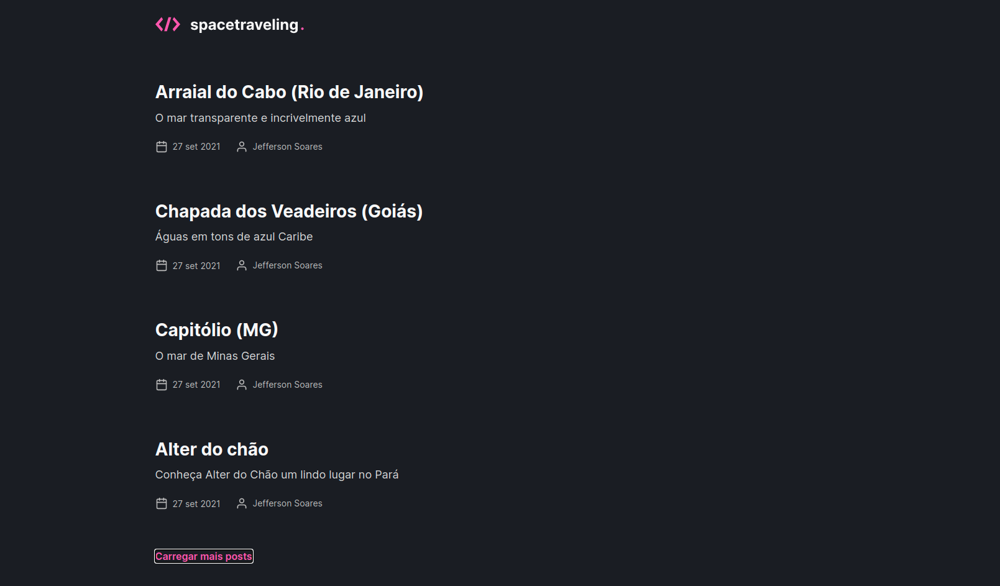
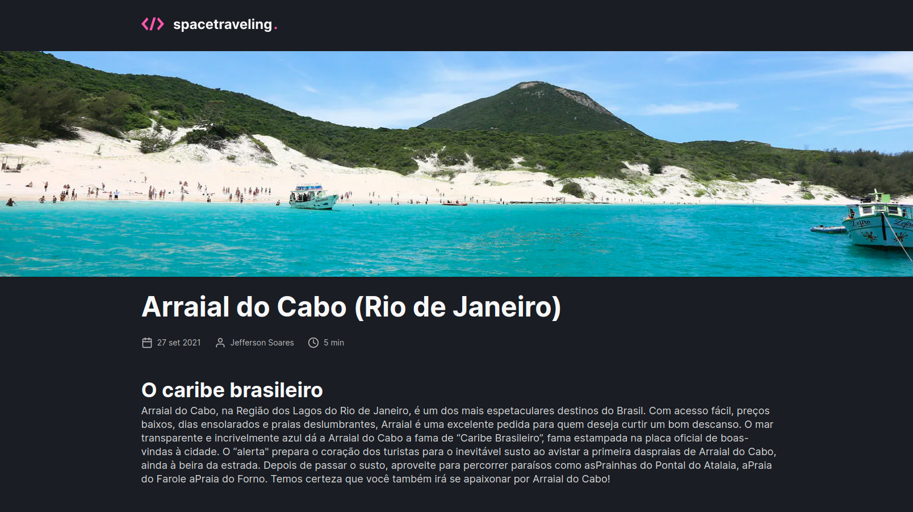
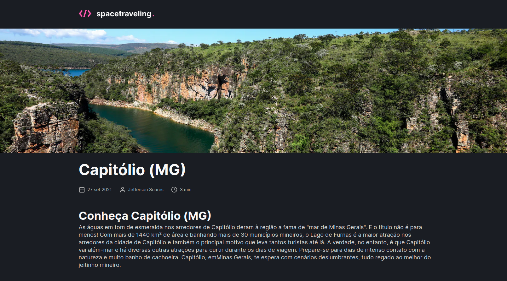

<h1 align="center">
  
</h1>

<p align="center">
  
  
</p>

# 💻 About this project
A site about places to travel, tells about the places, when is the best time to go, and other tips. The content is managed by **Prismic CMS**, and the application development was done using **Next.js** and **Typescript** as the main technology.

# :hammer: Technologies
This project was developed with the following Tools:
- **[TypeScript](https://www.typescriptlang.org/)**
- **[Next.js](https://nextjs.org/)**
- **[Prismic CMS](https://prismic.io/)**

# 🚀 Run this project
```bash
# Clone this repository
$ git clone https://github.com/jefferson1104/spaceTraveling-nextjs.git

# Set the environment variables
# Follow the example of the .env.local.example file
# After the adjustments, rename it to .env.local

# Running application
$ yarn dev
```

# 🎨 Screenshots





